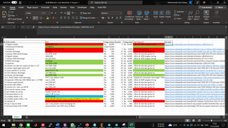

# 12s Battery Management System Research Project

## Introduction
*This repo used to collaborative work on BMS project*
This project initiated by Anargya Third Generation Electric Manager Plan, Abyqa on 2021.
He suggested us (4th Electric Generation) to create our independent BMS. 
In the next year, 2022, We (Rafli as Electric Manager, Faris as Head of Low Voltage Subdiv., Lazu as Head of High Voltage Subdiv) proposed new design according to last Molina BMS.
The schematics design is located in /Single Board 12s directory. Note: use the latest version _v<number>.sch

## My Last Progress
Last progress was programming with Arduino UNO (Faris, Gagas). 
The code located inside /Code directory.

## Challenge
PCB had been assembly with the components, but the SPI communication to LTC's register still couldn't be read. 
This problem probably caused by thin route layer between component pin to LTC. You can re-route Eagle board file and print again.
Suggestion: use thicker path and more than 2 layer. 
